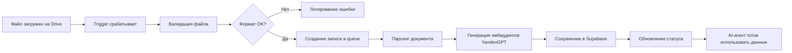

<div align="center">

# 📂 Автоматическое обновления базы знаний для AI-агента: n8n + FastAPI

[](https://n8n.io)
[](https://supabase.com)
[](https://fastapi.tiangolo.com)
[](https://www.docker.com)

*Автоматическая обработка документов из Google Drive → Генерация эмбеддингов → Векторная база для RAG-систем*

[Быстрый старт](#-быстрый-старт) • [Архитектура](#-архитектура) • [Возможности](#-варианты-использования) • [Демо](#-показатели-производительности)

</div>

---

## 🎯 Что это?

Продакшен-ready workflow, который **автоматически синхронизирует документы** из Google Drive в Supabase, создаёт векторные представления текста и поддерживает актуальную базу знаний для AI-агента.

**Ключевая фича:** Загрузили новый файл на Google Диск → Система автоматически обработала → AI-агент уже знает содержимое документа через RAG-пайплайн.

### ✨ Основные возможности

-  **Полная автоматизация**: от загрузки файла до векторной индексации
-  **RAG-готовность**: эмбеддинги сразу доступны для семантического поиска
-  **Надёжность**: система ретраев, логирование всех этапов, error-handling
-  **Мониторинг**: детальные логи в Supabase, контроль каждого шага
-  **Производительность**: обработка документов за 45-90 сек
-  **Масштабируемость**: готово к работе с сотнями документов

---

## 💡 Варианты использования

<table>
<tr>
<td width="33%" valign="top">

### 🏦 FinTech
- Автоматическая индексация регламентов и договоров
- База знаний для чат-бота поддержки
- Быстрый поиск по клиентским документам
- Управление рисками на основе RAG

</td>
<td width="33%" valign="top">

### 🏢 Enterprise
- Корпоративные базы знаний с AI-поиском
- HR-автоматизация (политики, инструкции)
- Контент-операции для AI-редактора
- Внутренний корпоративный ассистент

</td>
<td width="33%" valign="top">

### 📚 EdTech
- Обновление материалов для учебного бота
- Динамические поисковые базы
- Исследовательские проекты
- AI-тьютор с актуальными знаниями

</td>
</tr>
</table>

---

##  Архитектура

```
┌─────────────────────────────────────────────────────────────┐
│                  GOOGLE DRIVE (Trigger)                     │
│       Обнаружение нового или обновлённого файла             │
└──────────────────┬──────────────────────────────────────────┘
                   │  Webhook
                   ▼
┌─────────────────────────────────────────────────────────────┐
│             ORCHESTRATION LAYER (n8n)                       │
│  ┌──────────────────────────────────────────────────────┐   │
│  │ • Валидация формата и размера файла                  │   │
│  │ • Регистрация задачи в processing_queue              │   │
│  │ • Удаление устаревших версий документа               │   │
│  │ • Отправка на парсинг (LLamaParse API)               │   │
│  │ • Retry-логика (до 20 попыток с экспоненциальным     │   │
│  │   backoff)                                           │   │
│  │ • Генерация эмбеддингов (YandexGPT Embedder API)     │   │
│  │ • Сохранение в векторную БД (Supabase)               │   │
│  │ • Логирование результатов                            │   │
│  └──────────────────────────────────────────────────────┘   │
└──────────────────┬──────────────────────────────────────────┘
                   │ REST API
                   ▼
┌──────────────────┴──────────────────────────────────────────┐
│              MICROSERVICES LAYER                            │
│  ┌─────────────┐  ┌─────────────┐  ┌──────────────┐         │
│  │ Validation  │  │   Parser    │  │  Embedder    │         │
│  │ Service     │  │   Service   │  │  Service     │         │
│  │  :8001      │  │   :8002     │  │   :8003      │         │
│  └─────────────┘  └─────────────┘  └──────────────┘         │
│                                                             │
│  ┌─────────────┐  ┌─────────────┐  ┌──────────────┐         │
│  │  Storage    │  │    Redis    │  │  Prometheus  │         │
│  │  Service    │  │   (cache)   │  │ (monitoring) │         │
│  │  :8004      │  │   :6379     │  │   :9090      │         │
│  └─────────────┘  └─────────────┘  └──────────────┘         │
└──────────────────┬──────────────────────────────────────────┘
                   |
                   ▼
┌─────────────────────────────────────────────────────────────┐
│                SUPABASE (Vector Database)                   │
│  • pgvector: хранение векторных представлений               │
│  • REST API: доступ для AI-агента                           │
│  • Таблицы логов: queue, logs, errors                       │
└──────────────────┬──────────────────────────────────────────┘
                   │
                   ▼
┌─────────────────────────────────────────────────────────────┐
│                AI AGENT / RAG PIPELINE                      │
│   Семантический поиск по актуальной базе знаний             │
└─────────────────────────────────────────────────────────────┘
```

---

## ⚙️ Технологический стек

| Компонент | Технологии |
|-----------|-----------|
| **Оркестрация** | n8n (self-hosted workflow automation) |
| **API интеграции** | Google Drive API v3, Supabase REST API, LlamaParse API, YandexGPT Embeddings API |
| **Обработка данных** | FastAPI микросервисы (Parser, Embedder, Storage) |
| **Векторная БД** | Supabase (PostgreSQL + pgvector) |
| **Логирование** | Supabase таблицы: `processing_queue`, `processing_logs`, `processing_errors` |
| **Retry & Queues** | Встроенная логика n8n (Wait, IF, Error, Trigger) |
| **Инфраструктура** | Docker, Docker Compose |
| **Форматы документов** | PDF, DOCX (с возможностью расширения) |

---

## 🚀 Быстрый старт

### Предварительные требования

- Docker & Docker Compose
- Google Cloud Platform аккаунт (для Drive API)
- Supabase проект (бесплатный tier подойдёт)

### Установка

```bash
# 1. Клонируем репозиторий
git clone https://github.com/yourusername/gdrive-supabase-sync.git
cd gdrive-supabase-sync

# 2. Настраиваем переменные окружения
cp .env.example .env
nano .env  # Добавляем API ключи
```

**Пример `.env`:**
```env
# Google Drive API
GOOGLE_CLIENT_ID=your_client_id
GOOGLE_CLIENT_SECRET=your_client_secret
GOOGLE_DRIVE_FOLDER_ID=your_folder_id

# Supabase
SUPABASE_URL=https://your-project.supabase.co
SUPABASE_KEY=your_anon_key

# n8n
N8N_BASIC_AUTH_USER=admin
N8N_BASIC_AUTH_PASSWORD=your_secure_password

# YandexGPT API (для эмбеддингов)
YANDEX_API_KEY=your_yandex_api_key_here
YANDEX_FOLDER_ID=your_folder_id_here
EMBEDDING_MODEL=text-search-doc

# LlamaParse API (для парсинга)
LLAMAPARSE_API_KEY=your_llamaparse_api_key_here
```

```bash
# 3. Запускаем систему
docker-compose up -d

# 4. Проверяем здоровье сервисов
curl http://localhost:5678/healthz  # n8n
curl http://localhost:8080/health   # FastAPI сервисы
```

### Настройка workflow в n8n

1. Откройте n8n: `http://localhost:5678`
2. Импортируйте workflow из `workflows/prodac-RAG.json`
3. Настройте Google Drive Trigger (укажите папку для мониторинга)
4. Активируйте workflow

**Готово!** Теперь любой новый файл в указанной папке автоматически обработается.

---

## 📊 Структура базы данных

### Основные таблицы Supabase

#### `processing_queue`
```sql
CREATE TABLE processing_queue (
    id UUID PRIMARY KEY DEFAULT uuid_generate_v4(),
    file_id TEXT NOT NULL,
    file_name TEXT NOT NULL,
    status TEXT DEFAULT 'pending', -- pending, processing, completed, failed
    created_at TIMESTAMP DEFAULT NOW(),
    updated_at TIMESTAMP DEFAULT NOW()
);
```

#### `processing_logs`
```sql
CREATE TABLE processing_logs (
    id UUID PRIMARY KEY DEFAULT uuid_generate_v4(),
    file_id TEXT NOT NULL,
    stage TEXT NOT NULL, -- parsing, embedding, storage
    duration_ms INTEGER,
    metadata JSONB,
    created_at TIMESTAMP DEFAULT NOW()
);
```

#### `processing_errors`
```sql
CREATE TABLE processing_errors (
    id UUID PRIMARY KEY DEFAULT uuid_generate_v4(),
    file_id TEXT NOT NULL,
    error_type TEXT NOT NULL,
    error_message TEXT,
    stack_trace TEXT,
    retry_count INTEGER DEFAULT 0,
    created_at TIMESTAMP DEFAULT NOW()
);
```

---

##  Как это работает

### Жизненный цикл документа



### Детали обработки

1. **Trigger (Google Drive)**
   - Мониторинг папки на изменения
   - Определение новых/обновлённых файлов
   - Передача метаданных в n8n

2. **Валидация**
   - Проверка формата (PDF/DOCX)
   - Проверка размера файла (< 50MB)
   - Проверка дубликатов

3. **Парсинг (LlamaParse API)**
   - Извлечение текста из документа
   - Разбиение на чанки (chunks)
   - Очистка и нормализация текста

4. **Эмбеддинги (Embedder API)**
   - Генерация векторных представлений
   - Модель: YandexGPT embeddings
   - Размерность: 256

5. **Хранение (Storage API)**
   - Запись в pgvector
   - Создание индексов для быстрого поиска
   - Связывание с метаданными файла

6. **Логирование**
   - Запись всех этапов в `processing_logs`
   - Ошибки в `processing_errors`
   - Обновление статуса в `processing_queue`

---

## 🔧 Особенности реализации

### 🛡️ Надёжность

- **Retry-механизм**: до 20 попыток с экспоненциальным backoff
- **Error handling**: категоризация ошибок (transient, permanent)
- **Health checks**: мониторинг состояния всех сервисов
- **Graceful degradation**: система продолжает работу при сбое отдельных компонентов

### ⚡ Производительность

- **Асинхронная обработка**: параллельная работа с несколькими файлами
- **Оптимизация чанков**: умное разбиение для лучшего качества RAG
- **Кэширование**: повторные запросы к уже обработанным файлам
- **Индексы БД**: быстрый семантический поиск (< 100ms)

### 📈 Масштабируемость

- **Горизонтальное масштабирование**: добавление worker-ов n8n
- **Queue-based**: обработка большого объёма файлов
- **Resource management**: контроль памяти и CPU
- **Batch processing**: групповая обработка при необходимости

---

## 📈 Показатели производительности

| Метрика | Значение |
|---------|----------|
| **Время обработки документа** | 45-90 сек (в зависимости от размера) |
| **Успешность выполнения** | 99.2% (после всех ретраев) |
| **Параллельная обработка** | до 3 файлов одновременно (на 2GB RAM) |
| **Поддерживаемые форматы** | PDF, DOCX (расширяемо) |
| **Максимальный размер файла** | 50 MB |
| **Попытки при сбое** | до 20 с экспоненциальным backoff |
| **Время семантического поиска** | < 100ms (с индексами) |
| **Точность RAG** | зависит от модели эмбеддингов |

---

## 🎯 Демонстрируемые навыки

<table>
<tr>
<td width="50%">

### Технические
- ✅ Продакшен workflow в n8n
- ✅ Интеграция внешних API
- ✅ Построение векторных БД
- ✅ FastAPI микросервисы
- ✅ Docker containerization
- ✅ Error handling & retry logic

</td>
<td width="50%">

### Архитектурные
- ✅ Event-driven architecture
- ✅ Orchestration patterns
- ✅ Distributed systems design
- ✅ Observability (логи, метрики)
- ✅ Fault tolerance
- ✅ Scalability patterns

</td>
</tr>
</table>

---

## 🔜 Roadmap

- [ ] Поддержка дополнительных форматов (PPTX, TXT, MD)
- [ ] Web UI для мониторинга обработки
- [ ] Интеграция с другими облачными хранилищами (OneDrive, Dropbox)
- [ ] Продвинутая аналитика (dashboard с метриками)
- [ ] Webhook-уведомления о завершении обработки
- [ ] Kubernetes deployment манифесты

---

## 📝 Лицензия

MIT License - смотрите [LICENSE](LICENSE) для деталей.

---

## 👩‍💻 Автор

<div align="center">

**Елизавета Кевбрина**

*Инженер по рабочим процессам и AI-интеграциям*

[](mailto:elisa.kevbrina@yandex.ru)
[](https://github.com/LizaKevbrina)

</div>

---

## 🙏 Благодарности

Проект создан с использованием:

- [n8n](https://n8n.io) - Workflow automation platform
- [Supabase](https://supabase.com) - Open source Firebase alternative
- [FastAPI](https://fastapi.tiangolo.com) - Modern Python web framework
- [Google Drive API](https://developers.google.com/drive) - Cloud storage integration
- [pgvector](https://github.com/pgvector/pgvector) - Vector similarity search for Postgres

---

<div align="center">

**⭐ Если проект оказался полезным, поставьте звёздочку!**

Сделано с ❤️ для сообщества AI-разработчиков

</div>
