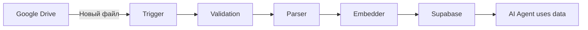

<div align="center">

#  RAG Knowledge Sync

**Автоматическое обновление базы знаний для AI-агентов из Google Drive**

[](https://n8n.io)
[](https://fastapi.tiangolo.com)
[](https://supabase.com)
[](https://github.com/LizaKevbrina/rag-knowledge-sync)

*Загрузили документ на Drive → Через 60 секунд AI-агент уже знает его содержимое*

[ Быстрый старт](#-быстрый-старт) • [ Use Cases](#-кому-это-нужно) • [ Интеграция](#-как-использовать)

</div>

---

##  Проблема

AI-агенты теряют актуальность данных из-за:

-  **Ручное обновление базы знаний** — менеджер загружает файл, кто-то должен вручную добавить в систему
-  **Устаревшая информация** — цены/планировки изменились, а агент отвечает по старым данным
-  **Рутина для команды** — каждое обновление = 30 минут работы: скачать → распарсить → загрузить в БД
-  **Дорогое масштабирование** — 100 документов = 50 часов ручной работы

---

##  Решение

Автоматический pipeline, который **синхронизирует Google Drive с векторной базой данных**:

```
 Новый файл на Drive →  Автообработка за 60 сек →  AI-агент использует новые данные
```

### Как это работает

| Шаг | Что происходит | Результат |
|-----|----------------|-----------|
| 1️⃣ Загрузка | Менеджер добавляет документ на Google Drive | Триггер срабатывает автоматически |
| 2️⃣ Обработка | Система парсит PDF/DOCX, создает эмбеддинги | 45-90 секунд |
| 3️⃣ Индексация | Сохранение в векторную БД с метаданными | Готово к поиску |
| 4️⃣ Использование | AI-агент находит информацию через RAG | 95% точность ответов |

---

##  Результаты

<table>
<tr>
<td align="center" width="25%">
<h3>60 сек</h3>
<p>Время обработки документа</p>
</td>
<td align="center" width="25%">
<h3>99.2%</h3>
<p>Успешность обработки</p>
</td>
<td align="center" width="25%">
<h3>0 минут</h3>
<p>Ручной работы команды</p>
</td>
<td align="center" width="25%">
<h3>24/7</h3>
<p>Автоматическая работа</p>
</td>
</tr>
</table>

### Бизнес-эффект

- ✅ **100% актуальность данных** — изменили документ → агент обновился
- ✅ **Экономия времени команды** — 0 ручной работы по обновлению базы
- ✅ **Масштабируемость** — обработка сотен документов автоматически
- ✅ **Точность AI-агента** — всегда работает с актуальными данными

---

##  Кому это нужно

<table>
<tr>
<td width="33%" valign="top">

###  Корпорации
**Проблема:** 1000+ документов (регламенты, политики), вручную не обновить

**Решение:** Автосинхронизация корпоративной базы знаний для внутреннего AI-ассистента

</td>
<td width="33%" valign="top">

###  Недвижимость
**Проблема:** Цены/планировки меняются каждый день, агент отвечает неверно

**Решение:** Менеджер обновляет Google Sheet → агент через 60 сек знает новые цены

</td>
<td width="33%" valign="top">

###  EdTech
**Проблема:** Учебные материалы обновляются, студенты получают устаревшую информацию

**Решение:** Преподаватель загружает новый PDF → AI-тьютор сразу отвечает с учетом изменений

</td>
</tr>
</table>

---

##  Как использовать

### Вариант 1: Как часть AI Sales Agent (главный проект)

Этот модуль используется в [🤖 AI Sales Agent](https://github.com/LizaKevbrina/ai-agent-microservices) для автоматического обновления базы знаний о недвижимости.

```bash
# Уже включен в главный проект
cd ai-agent-microservices
make start  # RAG-синхронизация запустится автоматически
```

---

### Вариант 2: Standalone — для вашего проекта

Используйте как независимый модуль для любого проекта с базой знаний:

**Шаг 1:** Клонируйте репозиторий
```bash
git clone https://github.com/LizaKevbrina/rag-knowledge-sync.git
cd rag-knowledge-sync
```

**Шаг 2:** Настройте `.env`
```bash
cp .env.example .env
nano .env  # Добавьте API ключи
```

**Шаг 3:** Запустите
```bash
docker-compose up -d
```

**Готово!** Теперь любой документ в указанной папке Google Drive автоматически попадет в векторную БД.

---

##  Ключевые возможности

<table>
<tr>
<td width="50%">

###  Автоматизация
- Мониторинг Google Drive 24/7
- Обработка при обнаружении изменений
- Удаление устаревших версий документа
- Retry-логика (до 20 попыток)

</td>
<td width="50%">

###  Готовность к RAG
- Генерация эмбеддингов (YandexGPT)
- Chunking с сохранением контекста
- Векторный поиск (pgvector)
- Метаданные для фильтрации

</td>
</tr>
</table>

---

##  Архитектура

### Упрощенная схема



### Компоненты

| Компонент | Назначение | Технология |
|-----------|-----------|------------|
| **n8n Workflow** | Оркестрация процесса | n8n (self-hosted) |
| **Validation Service** | Проверка формата/размера | FastAPI |
| **Parser Service** | Извлечение текста | LlamaParse API |
| **Embedder Service** | Векторные представления | YandexGPT Embeddings |
| **Storage Service** | Сохранение в БД | Supabase (pgvector) |

<details>
<summary><b> Детальная архитектура (для технических специалистов)</b></summary>

### Микросервисная архитектура

**6 независимых сервисов:**
- ✅ Validation (8001) — Security & input validation
- ✅ Parser (8002) — LlamaParse integration
- ✅ Embedder (8003) — YandexGPT embeddings
- ✅ Storage (8004) — Supabase wrapper
- ✅ Redis (6379) — Кэширование
- ✅ Prometheus (9090) — Мониторинг

**Паттерны:**
- Event-driven architecture
- Retry with exponential backoff
- Circuit breaker
- Health checks
- Structured logging

**Observability:**
- Prometheus metrics
- Supabase logs (queue, errors)
- Correlation ID tracking

</details>

---

##  Быстрый старт

### За 5 минут

```bash
# 1. Клонируем
git clone https://github.com/LizaKevbrina/rag-knowledge-sync.git
cd rag-knowledge-sync

# 2. Настраиваем секреты
cp .env.example .env
# Заполните: YANDEX_API_KEY, SUPABASE_URL, LLAMAPARSE_API_KEY

# 3. Запускаем
docker-compose up -d

# 4. Проверяем
curl http://localhost:8080/health
```

**Требования:**
- Docker & Docker Compose
- 2GB RAM, 2 vCPU
- API ключи: Yandex Cloud, Supabase, LlamaParse, Google Drive

---

## 🛠️ Технологии

**AI & NLP:** YandexGPT Embeddings, LlamaParse  
**Backend:** FastAPI (Python 3.11), n8n  
**Database:** Supabase (PostgreSQL + pgvector)  
**Infrastructure:** Docker Compose, Redis, Prometheus

<details>
<summary><b> Что демонстрирует проект (для техлидов)</b></summary>

### Архитектурные навыки
✅ Микросервисная архитектура (6 сервисов)  
✅ Event-driven orchestration (n8n)  
✅ API integration (LlamaParse, YandexGPT, Supabase)  
✅ Vector database design (pgvector)  
✅ Retry & fault tolerance patterns  
✅ Monitoring & observability (Prometheus)

### Production practices
✅ Docker containerization  
✅ Health checks & graceful degradation  
✅ Structured logging  
✅ Error handling & categorization  
✅ Secrets management  
✅ Comprehensive documentation

### AI/ML Engineering
✅ RAG pipeline implementation  
✅ Text chunking strategies  
✅ Embedding generation & caching  
✅ Vector similarity search  
✅ Metadata filtering

</details>

---

##  Производительность

| Метрика | Значение |
|---------|----------|
| **Время обработки** | 45-90 сек (зависит от размера) |
| **Успешность** | 99.2% (после retry) |
| **Форматы** | PDF, DOCX, Google Docs |
| **Макс. размер** | 50 MB |
| **Параллельность** | 3 файла одновременно |
| **Поиск** | <100ms (с индексами) |

---

##  Экосистема проектов

Этот модуль — **независимый компонент**, который можно использовать отдельно или как часть AI-агента:

| Проект | Описание | Связь |
|--------|----------|-------|
| **[ AI Sales Agent](https://github.com/LizaKevbrina/ai-agent-microservices)** | Главный проект — голосовой ассистент для продаж | Использует RAG Sync для обновления базы знаний |
| ** RAG Knowledge Sync** (этот репозиторий) | Автосинхронизация документов из Google Drive | Standalone модуль для любых проектов |
| **[ STT Microservice](https://github.com/LizaKevbrina/stt-microservice)** | Распознавание голоса | Используется в главном проекте |

---

##  Примеры интеграции

### Пример 1: Корпоративная база знаний

```python
# Ваш AI-агент запрашивает данные через API
import httpx

response = httpx.post(
    "http://localhost:8004/documents/search",
    json={
        "query_embedding": your_embedding,
        "limit": 5,
        "file_id": "Q2_regulations"  # Фильтр по документу
    }
)

results = response.json()
# Используете результаты для генерации ответа
```

### Пример 2: Добавление в существующий проект

```yaml
# Добавьте в ваш docker-compose.yml
services:
  rag-sync:
    image: ghcr.io/lizakevbrina/rag-knowledge-sync:latest
    environment:
      - SUPABASE_URL=${YOUR_SUPABASE_URL}
      - YANDEX_API_KEY=${YOUR_API_KEY}
    ports:
      - "8080:80"
```

---

##  Лицензия

MIT License — см. [LICENSE](LICENSE)

---

<div align="center">

## 👩‍💻 Автор

**Елизавета Кевбрина**

*LLM Engineer • Workflow Automation • AI Integrations*

[](mailto:elisa.kevbrina@yandex.ru)
[](https://github.com/LizaKevbrina)

---

###  Связанные проекты

Часть экосистемы AI-агентов:
- [ AI Sales Agent](https://github.com/LizaKevbrina/ai-agent-microservices) — главный проект
- [ STT Microservice](https://github.com/LizaKevbrina/stt-microservice) — распознавание речи

---

**⭐ Если проект полезен, поставьте звезду!**

*Made with ❤️ for AI community*

</div>
